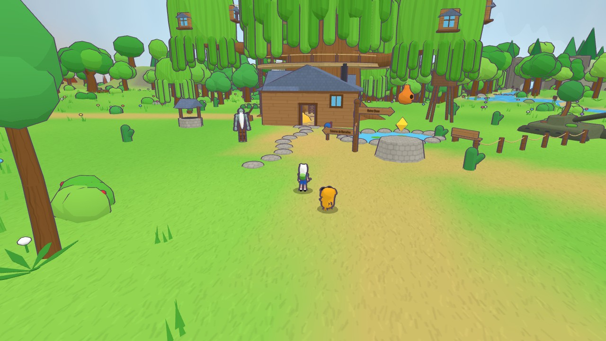
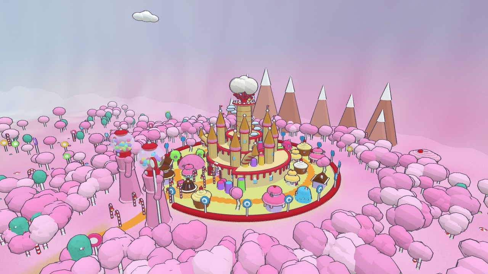
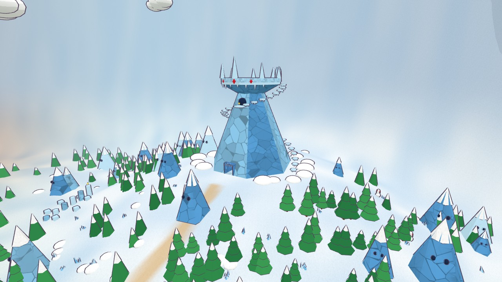
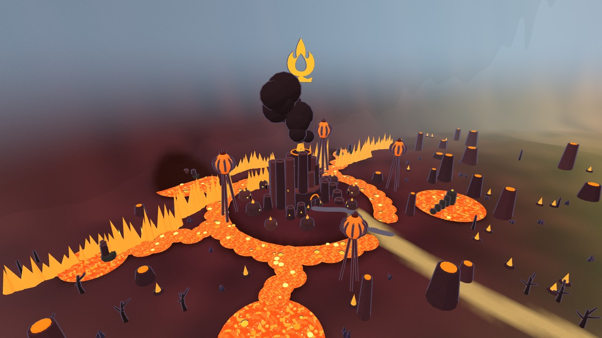
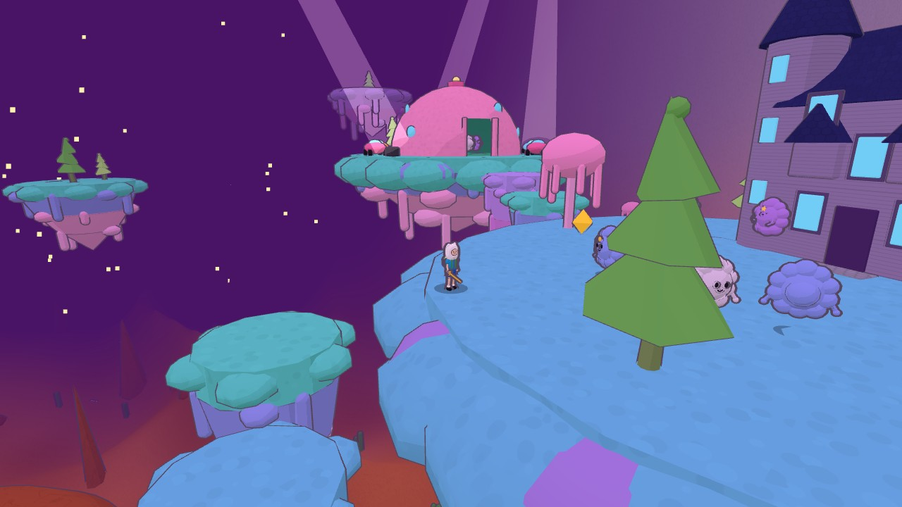
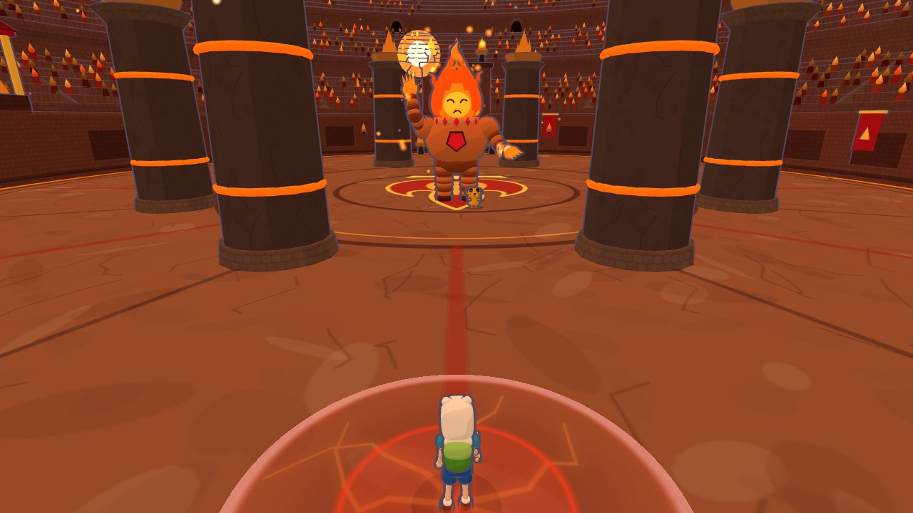

# Hora de Aventura — Terra de Ooo

Jogo 3D de mundo aberto, single-player, feito por fã. Você é o Finn, com o Jake do lado, explorando a Terra de Ooo: a Casa da Árvore, o Reino Doce, o Reino Gelado, o Reino do Fogo, a casa da Marceline, o Espaço Caroçudo e muito mais.

Tudo é feito em [Three.js](https://threejs.org/), com os modelos criados direto no código. Não tem build nem `npm install`, e funciona sem internet.

> Projeto de fã, sem fins lucrativos e sem ligação com a Cartoon Network. *Hora de Aventura* (*Adventure Time*) e seus personagens pertencem aos seus donos.

| | |
|---|---|
|  |  |
| **Reino Doce** | **Reino Gelado** |
|  |  |
| **Reino do Fogo** | **Espaço Caroçudo** |

## Como rodar

Você só precisa do [Node.js](https://nodejs.org/) **20.11 ou mais novo**.

1. Baixe o repositório (`git clone` ou **Code → Download ZIP**).
2. Abra o jogo:
   - **Windows:** dê dois cliques em `JOGAR.bat`.
   - **Qualquer sistema:** abra um terminal na pasta e rode `node servidor.mjs`.
3. O navegador abre sozinho em http://127.0.0.1:5391/. Se a porta estiver ocupada, o servidor tenta as seguintes até a 5410. O endereço certo aparece no terminal.
4. Clique em **Jogar**.

Deixe a janela do terminal aberta enquanto joga e feche quando terminar. O progresso fica salvo no navegador, então use sempre o mesmo navegador para continuar de onde parou. Para recomeçar, use **Novo jogo** no menu.

Recomendo um navegador atual (Chrome, Edge ou Firefox). O jogo baixa a resolução sozinho quando o computador não dá conta.

## Controles

| Ação | Teclado e mouse | Controle |
|---|---|---|
| Andar | `W A S D` ou setas | analógico esquerdo |
| Correr | `Shift` | `RT` |
| Pular / pulo duplo | `Espaço` (de novo no ar) | `A` |
| Espada (combo; no ar, giro) | `J` ou clique | `X` |
| Punho gigante do Jake | `Q` ou `K` | `B` |
| Conversar | `E` ou `Enter` | `Y` |
| Onda de Fogo (quando você ganhar) | `F` | `RB` |
| Câmera | mouse (clique na tela para prender o cursor); roda = zoom | analógico direito |
| Pausar (e ver as pistas) | `Esc` ou `P` | `Start` / `Menu` |

Escadas: ande até elas e use `W` / `S`. O `Espaço` solta.

No celular ou tablet, o lado esquerdo da tela anda e o direito gira a câmera. Os botões aparecem na tela.

## Como jogar

- **Comece pelo Billy**, na frente da Casa da Árvore. Ele te dá a primeira missão e diz o que fazer depois.
- **Gosmas:** quando uma gosma se encolhe e fica vermelha, ela vai pular em você. Acerte antes ou saia da frente. Pisar em cima também estoura. Elas soltam corações.
- **Cristais:** há cristais escondidos por Ooo. Converse com os personagens (BMO, as princesas, a Marceline, o Rei Gelado…): eles contam onde procurar. Cada pista fica anotada no menu de pausa. Se empacar, pergunte ao Jake quem pode saber.
- **Chefes:** o Rei Gelado, o Mordomo Menta e o Rei de Fogo, nessa ordem. Cada um abre depois de uma missão com quem pede ajuda. Cada vitória dá um diamante e um prêmio (corações a mais, espadas, poderes). As lutas são difíceis de propósito: observe os círculos que se enchem no chão e saia antes que cheguem à borda.
- **Explore:** dá para entrar nas casas e nos castelos, e tem lugar escondido no alto e até no céu.

## Para quem vai mexer no código

- O código do jogo fica em `jogo/` (módulos ES, abre direto no navegador). `servidor.mjs` só serve os arquivos.
- `node servidor.mjs --dev` recarrega a página a cada arquivo salvo.
- `http://127.0.0.1:5391/?debug=1` mostra fps, draw calls e posição. As teclas 1–9 teletransportam para os marcos do mapa.
- Todo texto que aparece na tela está em `jogo/strings.js`.
- O `CLAUDE.md` tem o mapa detalhado de cada arquivo e as convenções do projeto.
